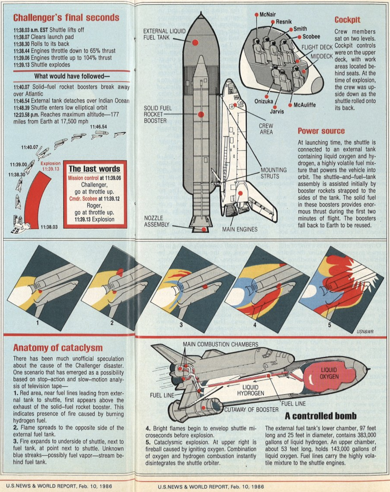

After the space shuttle Challenger disaster (**Figure 1**) on January 28th, 1986, most people agreed on the cause of the incident - the O-rings that sealed the joints on the right solid rocket booster failed under cold conditions ([Lewis, 1988](https://www.amazon.com/Challenger-Voyage-Richard-S-Lewis/dp/023106490X)). What most failed to recognize, however, was a more fundamental problem. The casual disregard of outliers, in this case from a data set used by scientists and engineers involved in the flight to justify the launch in cold conditions, can yield catastrophic consequences. The purpose of this essay is to show that a routine procedure for analysts and scientists - outlier removal - not only introduces biases but, under some circumstances, can actually lead to lethal repercussions. This observation raises important moral questions for data scientists. 



The night before the launch of the space shuttle Challenger, executives and engineers from NASA and Morton Thiokol, the manufacturer of the solid rocket boosters, met to discuss the scheduled launch over a teleconference call ([Dalal et al. 1989](https://www.jstor.org/stable/2290069?seq=1)).  The subject of conversation was the sensitivity of O-rings (**Figure 2**) on the solid rocket boosters to the cold temperatures forecasted for the next morning. 

{width=350px}

Some of the engineers at Thiokol opposed the planned launch. The performance of the O-rings during the previous 23 test flights, they argued, suggested that temperature was influential (**Table 1**). When temperatures were low, for example between 53 and 65$^\circ$F, more O-rings failed than when temperatures were higher. 


```{r warning=FALSE, message=FALSE, echo=F}
library(ggplot2) # for plotting
library(knitr) # for tabulation
```

```{r echo=F}
# Import data
df = read.table("challenger.csv", header=T, sep=",")
# Present data
kable(df,
      caption = "Table 1: Previous flight number, temperature, pressure, number of failed O-rings, and number of total O-rings")
```


Some personnel at both agencies did not *see* this trend. They focused only on the flights where at least one O-ring had failed. That is, they ignored outlying cases where no O-rings failed because, from their perspective, they did not contribute any information ([Presidential Commission on the space shuttle Challenger Accident, 1986](https://history.nasa.gov/rogersrep/genindex.htm)). Their conclusion, upon inspection of data from **Figure 3**, was that “temperature data [are] not conclusive on predicting primary O-ring blowby” ([Presidential Commission on the space shuttle Challenger Accident, 1986](https://history.nasa.gov/rogersrep/genindex.htm)). Hence, they asked Thiokol for an official recommendation to launch. It was granted. 

```{r, echo=F, fig.cap="Figure 3. O-ring failure as a function of temperature"}  


# O-ring vs Temperature
ggplot(df, aes(x=Temp, y=as.factor(O.ring), colour=O.ring>0)) +
  geom_jitter(size = 1, alpha = 0.75, stroke=3, height=.05, width=.3) +
  scale_color_manual(labels = c("ignored","considered"),
                                values = rev(c("black","grey"))) +
  scale_x_continuous(name = "Temperature (°F)")+
  scale_y_discrete(name = "Number of\nO-ring failures") +
  #geom_rug(alpha=2/4, size=1, position="jitter") +
  theme_classic() +
  theme(text = element_text(size = 12)) +
  labs(title=expression(color="Observations:"))+
  theme(legend.position = c(0.5, 1.05), legend.title=element_text(size=9), legend.text=element_text(size=7)) +  
  theme(plot.title = element_text(hjust=0)) + 
  theme(
  axis.title.x = element_text(size = 12),
  axis.text.x = element_text(size = 12),
  axis.title.y = element_text(size = 12),
  axis.text.y = element_text(size = 12),
  plot.title = element_text(size = 12)) 
```
The next morning the Challenger launched and 7 people died.

After the incident, President Regan ordered William Rogers, former Secretary of State, to lead a commission to determine the cause of the explosion. The O-rings, the Commission found, became stiff and brittle in response to cold temperatures, thereby unable to maintain the seal between the joints of the solid rocket boosters. The case was solved. But a more fundamental lesson was missed. 

Outliers and their removal from data sets can introduce consequential biases. Although this may seem obvious, it is not. Some practitioners of data science essentially promote cavalier removal of observations that are different from the rest. They focus instead on the biases that can be introduced when certain outliers are included in analyses.

This practice is hubristic for at least one reason. We, as observers, do not, in most cases, completely understand the processes by which the data we collect are generated. To use [Plato’s allegory of the cave](https://en.wikipedia.org/wiki/Allegory_of_the_cave), we just see the shadows, not the actual objects. Indeed, this is one motivation to collect data. To remove data without defensible justification (e.g measurement or execution error) is to claim, even if implicitly, that we know how the data should be distributed. If true, then why collect data at all?  

To be clear, I am not arguing that outlier removal is indefensible under any condition. Instead, I am arguing that we should exercise caution and awareness of the consequences of our actions, both when classifying observations as outliers and ignoring or removing them. This point was acknowledged by the Rogers Commission in the statement: “a careful analysis of the flight history of O-ring performance would have revealed the correlation in O-ring performance in low temperature[s]” ([Presidential Commission on the space shuttle Challenger Accident, 1986](https://history.nasa.gov/rogersrep/genindex.htm)).

Unlike other issues in fields like data science, the solution here may not be technical. That is, a new diagnostic technique or test will likely not emancipate us from our moral obligations to others. Instead, we may need to iteratively update our philosophies of data analysis to maximize benefits, minimize harms, and satisfy our fiduciary responsibilities to society.
 


### References:
Dalal, S.R., Fowlkes, E.B., Hoadley, B. 1989. Risk analysis of the space shuttle: Pre-Challenger prediction of failure. Journal of the American Statistical Association.

Lewis, S. R. 1988. Challenger The Final Voyage. New York: Columbia University Press.

United States. 1986. Report to the President. Washington, D.C.: Presidential Commission on the Space Shuttle Challenger Accident.
